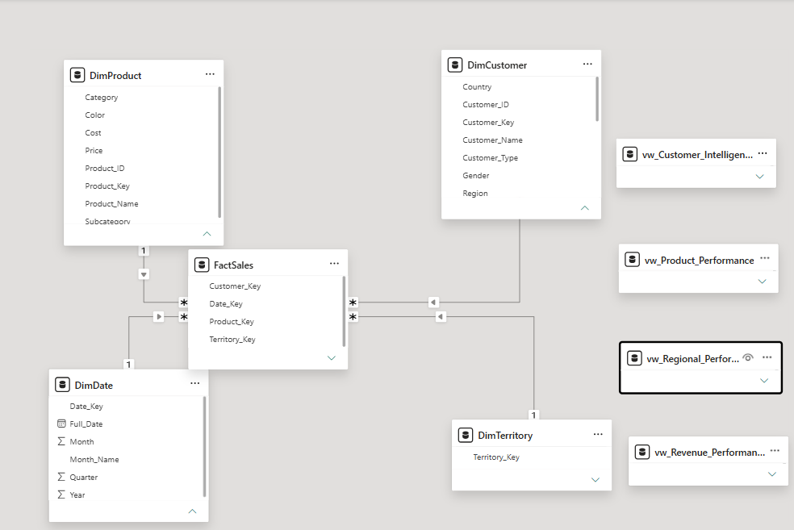
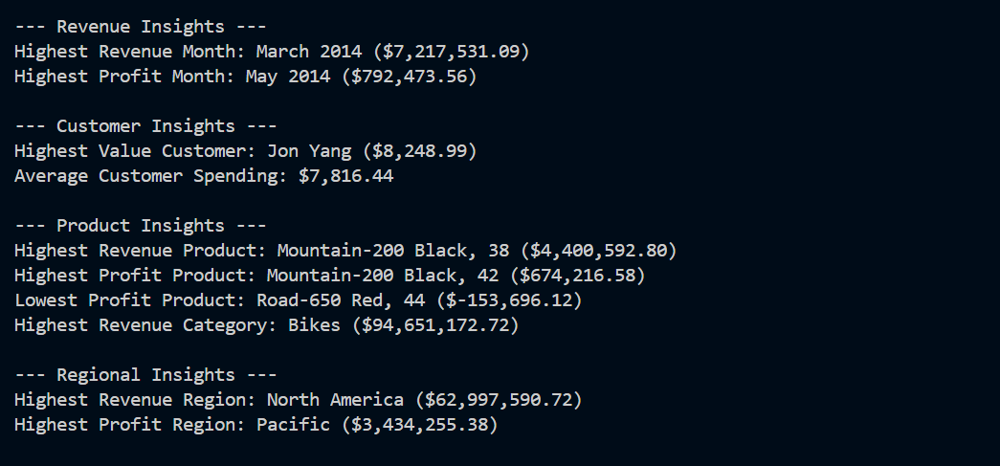
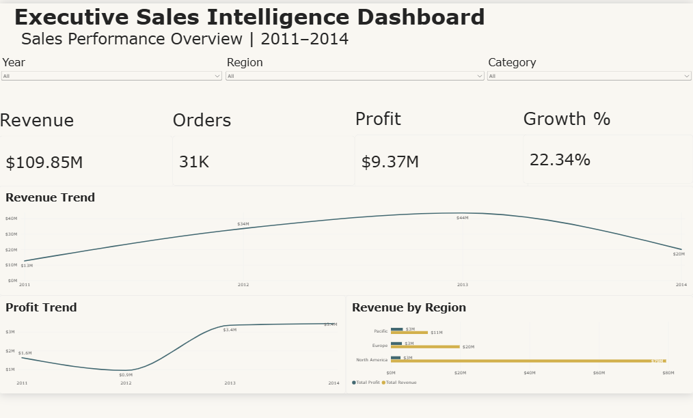
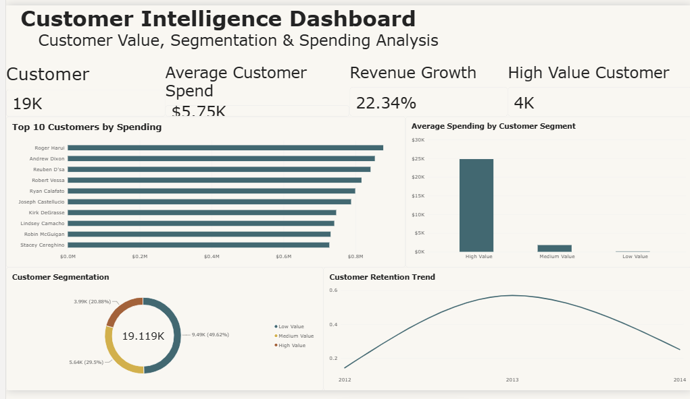
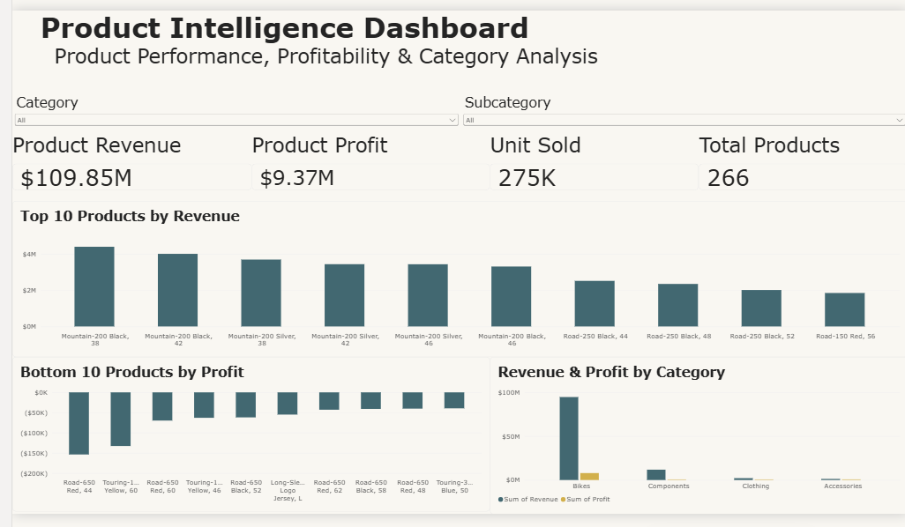

# Enterprise Business Intelligence & Analytics System

An end-to-end Business Intelligence portfolio project built with **Microsoft SQL Server, Python, and Power BI**.

The project transforms transactional data from the **AdventureWorks2022** database into a structured analytical data warehouse, performs business analysis using SQL and Python, and presents interactive insights through Power BI dashboards.

---

## Project Overview

This project demonstrates a complete Business Intelligence workflow:

- Data exploration and profiling
- Data quality validation
- Data warehouse development
- ETL implementation
- Star schema modeling
- SQL analytical views
- KPI development
- Python-based analytics
- Automated business insight generation
- Customer segmentation
- Power BI data modeling
- Interactive business dashboards
- Git version control

The analysis focuses on four major business areas:

- Sales performance
- Customer intelligence
- Product performance
- Regional performance

---

## Technology Stack

| Technology | Purpose |
|---|---|
| Microsoft SQL Server | Data warehouse and analytical database |
| SQL Server Management Studio | SQL development and database management |
| Python | Analytics and automation |
| Pandas | Data analysis |
| SQLAlchemy | SQL Server connectivity |
| PyODBC | ODBC database connection |
| Python-dotenv | Environment configuration |
| Power BI | Data visualization and dashboards |
| DAX | Measures, KPIs, and analytical calculations |
| Git | Version control |
| GitHub | Project hosting and portfolio presentation |

---

## Data Source

The project uses the **Microsoft AdventureWorks2022** sample transactional database.

### Analytical Period

**2011 – 2014**

The source data includes:

- Sales orders
- Sales order details
- Customers
- Products
- Product categories
- Product subcategories
- Sales territories
- Dates

---

## Business Intelligence Architecture

The overall project workflow is:

```text
AdventureWorks2022
        │
        ▼
Microsoft SQL Server
        │
        ├── Data Exploration
        ├── Data Quality Checks
        ├── ETL
        └── Data Warehouse
                │
                ▼
          Star Schema Model
                │
        ┌───────┴────────┐
        ▼                ▼
     Python           Power BI
   Analytics          Dashboards
        │                │
        └───────┬────────┘
                ▼
         Business Insights
```

---

## Data Warehouse Architecture

A **star schema** was developed in SQL Server.

### Dimension Tables

- `DimCustomer`
- `DimProduct`
- `DimDate`
- `DimTerritory`

### Fact Table

- `FactSales`

The `FactSales` table contains transactional measures and foreign keys including:

- Order ID
- Customer Key
- Product Key
- Territory Key
- Date Key
- Order Quantity
- Sales Amount
- Discount
- Profit

The original business `Order_ID` is retained in the fact table so that order KPIs count actual orders instead of individual sales-detail rows.

### Power BI Data Model

The analytical model connects the central `FactSales` table to customer, product, date, and territory dimensions.



---

## SQL Server Workflow

The SQL workflow is maintained in a single structured SQL file:

```text
SQL_Server/
└── Enterprise_BI_SQL_Workflow.sql
```

The workflow includes:

### 1. Data Exploration

Initial exploration of:

- Sales orders
- Order details
- Customers
- Products
- Categories
- Subcategories
- Territories

### 2. Data Quality Validation

Checks include:

- NULL values
- Duplicate records
- Missing customer relationships
- Missing product relationships
- Missing order details
- Source data volumes
- Sales period validation

### 3. Data Warehouse Creation

The SQL workflow creates:

```text
DimCustomer
DimProduct
DimDate
DimTerritory
FactSales
```

### 4. ETL Process

The ETL process:

1. Extracts data from AdventureWorks2022
2. Transforms customer and product attributes
3. Populates dimension tables
4. Generates the date dimension
5. Loads transactional data into `FactSales`
6. Calculates sales and profit measures
7. Retains the original Order ID for accurate order analysis

### 5. Analytical Views

Four analytical SQL views support reporting and Python analysis.

---

## SQL Analytical Views

### Revenue Performance

`vw_Revenue_Performance`

Analyzes:

- Monthly revenue
- Monthly profit
- Quantity sold
- Revenue trends

---

### Customer Intelligence

`vw_Customer_Intelligence`

Analyzes:

- Customer spending
- True order count
- Customer profitability
- Customer value

---

### Product Performance

`vw_Product_Performance`

Analyzes:

- Product revenue
- Product profit
- Units sold
- Category performance
- Subcategory performance

---

### Regional Performance

`vw_Regional_Performance`

Analyzes:

- Regional revenue
- Regional profit
- True order volume
- Country performance

---

## Python Analytics Layer

Python connects directly to the SQL Server analytical warehouse.

The Python layer performs additional analysis and automatically generates business insights.

### Python Project Files

```text
Python/
├── database_connection.py
├── analysis.py
├── revenue_analysis.py
├── customer_analysis.py
├── product_analysis.py
├── regional_analysis.py
└── generate_insights.py
```

### Database Connection

Database configuration is stored using environment variables rather than hard-coded connection information.

Example local `.env` configuration:

```env
DB_SERVER=YOUR_SQL_SERVER
DB_NAME=BI_Enterprise_Analytics
DB_DRIVER=ODBC Driver 17 for SQL Server
```

The `.env` file is excluded from GitHub through `.gitignore`.

---

## Python Analysis Modules

### Revenue Analysis

Identifies:

- Highest revenue month
- Highest profit month
- Monthly performance
- Revenue growth patterns
- Total revenue
- Total profit

### Customer Analysis

Analyzes:

- Highest-value customers
- Average customer spending
- Customer spending distribution
- Customer concentration

### Product Analysis

Identifies:

- Highest-revenue products
- Highest-profit products
- Lowest-profit products
- Category performance
- Product profitability

### Regional Analysis

Analyzes:

- Highest-revenue region
- Highest-profit region
- Regional revenue
- Regional profitability

---

## Automated Business Insight Generator

The `generate_insights.py` module combines the major analytical datasets and automatically produces a business intelligence summary.

Example output:

```text
======================================
     BUSINESS INTELLIGENCE SUMMARY
======================================

--- Revenue Insights ---
Highest Revenue Month: March 2014
Highest Profit Month: May 2014

--- Customer Insights ---
Highest Value Customer
Average Customer Spending

--- Product Insights ---
Highest Revenue Product
Highest Profit Product
Lowest Profit Product
Highest Revenue Category

--- Regional Insights ---
Highest Revenue Region
Highest Profit Region

======================================
        ANALYSIS COMPLETE
======================================
```

### Python Analytics Output



---

## Automated JSON Output

The generated business insights are also stored in structured JSON format:

```text
output/
└── business_insights.json
```

This makes the analytics output reusable for future applications, reporting systems, APIs, or additional automation.

---

# Power BI Dashboards

Three interactive Power BI dashboards were developed.

---

## 1. Executive Sales Intelligence Dashboard

Provides an executive overview of overall business performance.

### Key KPIs

- Total Revenue
- Total Profit
- Total Orders
- Revenue Growth %
- Profit Margin %

### Visualizations

- Monthly Revenue Trend
- Monthly Profit Trend
- Revenue by Region
- Interactive Year filter
- Interactive Region filter
- Interactive Category filter

### Dashboard Preview



---

## 2. Customer Intelligence Dashboard

Provides insights into customer value, behavior, spending, and retention.

### Analysis Includes

- Top Customers by Spending
- Customer Segmentation
- Average Spending by Customer Segment
- Customer Retention
- High-Value Customers
- Total Customers

Customer segmentation is designed to distinguish customers according to their relative spending behavior.

### Dashboard Preview



---

## 3. Product Intelligence Dashboard

Analyzes product and category performance.

### Key KPIs

- Product Revenue
- Product Profit
- Total Units Sold
- Total Products

### Analysis Includes

- Top 10 Products by Revenue
- Bottom 10 Products by Profit
- Revenue by Category
- Profit by Category
- Category Performance
- Product Profitability

### Dashboard Preview



---

# Key Business Insights

The analysis identified several important patterns in the AdventureWorks sales data.

### Revenue

- **March 2014** generated the highest monthly revenue at approximately **$7.22M**.
- **May 2014** generated the highest monthly profit at approximately **$792K**.

### Customers

- The analytics layer identifies the highest-value customer based on total spending.
- Average customer spending is calculated automatically from the analytical customer dataset.

### Products

- **Mountain-200 Black, 38** generated the highest product revenue.
- **Mountain-200 Black, 42** generated the highest product profit.
- **Road-650 Red, 44** was identified as the lowest-profit product.
- **Bikes** generated the highest category revenue.

### Regions

- **North America** generated the highest regional revenue.
- **Pacific** generated the highest regional profit.

These findings demonstrate how revenue leadership and profit leadership may come from different products, periods, and regions.

---

# Project Structure

```text
enterprise-business-intelligence-analytics/
│
├── SQL_Server/
│   └── Enterprise_BI_SQL_Workflow.sql
│
├── Python/
│   ├── database_connection.py
│   ├── analysis.py
│   ├── revenue_analysis.py
│   ├── customer_analysis.py
│   ├── product_analysis.py
│   ├── regional_analysis.py
│   └── generate_insights.py
│
├── PowerBI/
│   └── Enterprise_BI_Dashboard.pbix
│
├── Screenshots/
│   ├── 01_Executive_Dashboard.png
│   ├── 02_Customer_Dashboard.png
│   ├── 03_Product_Dashboard.png
│   ├── 04_Data_Model.png
│   └── 05_Python_Insights.png
│
├── output/
│   └── business_insights.json
│
├── .gitignore
├── requirements.txt
└── README.md
```

---

# Running the Project

## 1. Clone the Repository

```bash
git clone https://github.com/farhanruhullah/enterprise-business-intelligence-analytics.git
```

Move into the project:

```bash
cd enterprise-business-intelligence-analytics
```

---

## 2. Create a Virtual Environment

```bash
python -m venv .venv
```

### Activate on Windows PowerShell

```powershell
.venv\Scripts\Activate.ps1
```

---

## 3. Install Python Dependencies

```bash
pip install -r requirements.txt
```

---

## 4. Configure SQL Server

Create a `.env` file in the project root:

```env
DB_SERVER=YOUR_SQL_SERVER
DB_NAME=BI_Enterprise_Analytics
DB_DRIVER=ODBC Driver 17 for SQL Server
```

Do not commit `.env` to GitHub.

---

## 5. Prepare the Database

Restore or install the Microsoft AdventureWorks2022 sample database.

Then execute:

```text
SQL_Server/Enterprise_BI_SQL_Workflow.sql
```

This creates the analytical warehouse, loads the data, and creates the reporting views.

---

## 6. Test the Python Database Connection

```bash
python Python/database_connection.py
```

Expected result:

```text
Testing database connection...
Database connection successful.
```

---

## 7. Run Revenue Analysis

```bash
python Python/revenue_analysis.py
```

---

## 8. Run Customer Analysis

```bash
python Python/customer_analysis.py
```

---

## 9. Run Product Analysis

```bash
python Python/product_analysis.py
```

---

## 10. Run Regional Analysis

```bash
python Python/regional_analysis.py
```

---

## 11. Generate Complete Business Insights

```bash
python Python/generate_insights.py
```

The generated structured output is saved to:

```text
output/business_insights.json
```

---

# Power BI Usage

Open the Power BI project file:

```text
PowerBI/Enterprise_BI_Dashboard.pbix
```

If necessary, update the SQL Server data source credentials and refresh the dataset.

The report contains:

- Executive Sales Intelligence Dashboard
- Customer Intelligence Dashboard
- Product Intelligence Dashboard

---

# Data Modeling Improvements

Several data-modeling improvements were implemented during development.

### Accurate Order Counting

The original sales-detail grain can contain multiple rows for a single business order.

To prevent sales lines from being incorrectly counted as orders, the original `Order_ID` was added to `FactSales`.

Order KPIs therefore use distinct Order IDs.

### Cleaner Customer Dimension

Unused customer attributes containing only NULL values were removed from the final customer dimension to keep the warehouse model clean and purposeful.

### Secure Configuration

Database configuration was moved from Python source code into environment variables using `python-dotenv`.

This prevents machine-specific configuration from being hard-coded in the project.

---

# Skills Demonstrated

This project demonstrates practical experience with:

### SQL & Data Engineering

- SQL Server
- Data exploration
- Data validation
- ETL development
- Data warehouse design
- Star schema modeling
- Fact and dimension tables
- Analytical SQL views
- Aggregation
- Joins
- Business metrics

### Python

- Pandas
- SQLAlchemy
- PyODBC
- Environment variables
- Database connectivity
- Data analysis
- Business insight automation
- JSON output generation

### Power BI

- Data modeling
- DAX
- KPI development
- Interactive dashboards
- Slicers
- Customer segmentation
- Ranking
- Retention analysis
- Business visualization

### Development

- Git
- GitHub
- Virtual environments
- Requirements management
- Secure environment configuration
- Project documentation

---

# Business Questions Addressed

The project helps answer questions such as:

- How is revenue changing over time?
- Which months generate the highest revenue?
- Which months generate the highest profit?
- Which customers contribute the most revenue?
- How can customers be segmented by value?
- Which products generate the most revenue?
- Which products generate the most profit?
- Which products are underperforming?
- Which categories dominate sales?
- Which regions generate the most revenue?
- Which regions generate the most profit?
- How many real customer orders were placed?
- How effectively are customers being retained?

---

# Future Improvements

Potential future enhancements include:

- Incremental ETL loading
- Automated ETL scheduling
- SQL stored procedures
- Advanced RFM customer segmentation
- Customer churn analysis
- Sales forecasting
- Python visualization layer
- Automated reporting
- Cloud SQL deployment
- Power BI Service publishing
- Row-level security
- Data refresh automation

---

# Project Purpose

This project was developed as a practical portfolio project demonstrating end-to-end Business Intelligence capabilities across:

**SQL Server → Data Warehouse → Python Analytics → Power BI → Business Insights**

It is designed to demonstrate skills relevant to roles such as:

- Data Analyst
- Business Intelligence Analyst
- BI Developer
- Power BI Developer
- Junior Data Engineer
- Analytics Consultant

---

## Author

**Farhan Ruhullah**

Business Intelligence & Data Analytics Portfolio Project